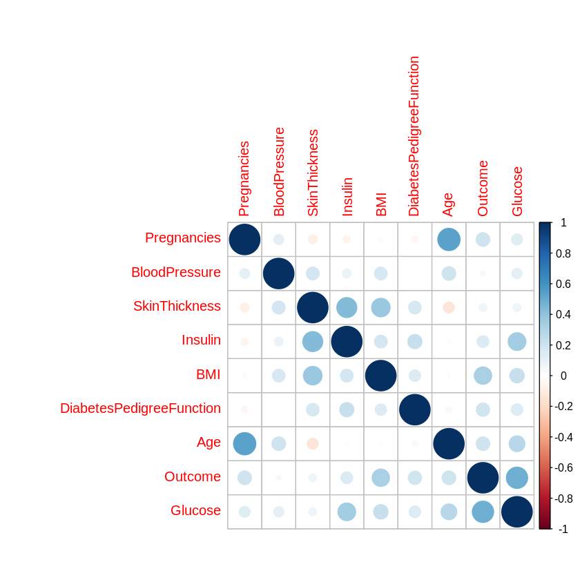
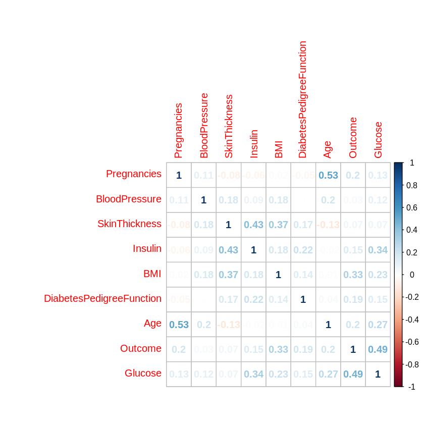
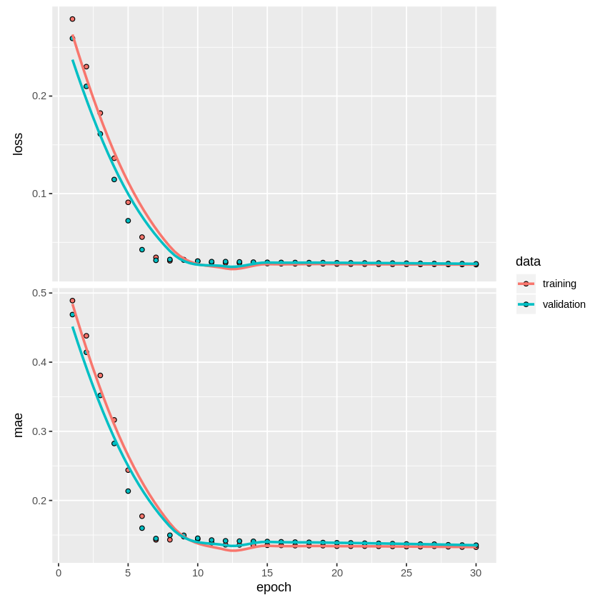
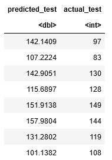

# Section 4 - TensorFlow 2.0 essentials: What's new (R)

With the advent of TensorFlow 2.0, *Keras* is now the default API for this version. Keras is used to build neural networks for deep learning purposes. As such, Keras is a highly useful tool for conducting analysis on large datasets.

However, did you realise that the Keras API can also be run in R?

In this example, *Keras* is used to generate a neural network - with the aim of solving a regression problem in R.

Specifically, the Pima Indians Diabetes dataset is used in order to predict blood glucose levels for patients using the relevant features.

In this regard, this article provides an overview of:

- Feature selection methods in R
- How to define a Sequential model in Keras
- Methods to validate and test model predictions

## Datasets

The Pima Indians Diabetes dataset is partitioned into three separate datasets for this example.

**Training and validation:** pima-indians-diabetes1.csv. 80% of the original dataset is split from the full dataset. In turn, 70% of this dataset is used for training the model, and the remaining 30% is used for validating the predictions.

**Test:** pima-indians-diabetes2.csv and pima-indians-diabetes3.csv. The remaining 20% of the original dataset is used as unseen data, to determine whether the predictions being yielded by the model would perform well when dealing with completely new data. pima-indians-diabetes2 contains the features (or independent variables), while pima-indians-diabetes3 contains the dependent variable (blood glucose levels).

## Feature Selection

The purpose of feature selection is to determine those features that have the most influence on the dependent variable.

In our example, there are eight features - some will be more important than others in determining blood glucose levels.

The two feature selection methods used here are:

- Correlation plots
- Multiple Linear Regression

### Correlation plots

Correlation plots allow us to visually determine:

1. Features that are highly correlated with the dependent variable
2. Features that are highly correlated with each other

If certain features are highly correlated with blood glucose levels, then this is an indication that these features are important in predicting the same. Features with low correlation are indicated to be insignificant.

However, features that are highly correlated with each other would indicate that some of these features are redundant (since they are in effect attempting to explain the same thing).

Here is the first correlation plot:

```
M <- cor(diabetes1)
corrplot(M, method = "circle")
```



We can see that the **Insulin** and **Outcome** variables are particularly correlated with the **Glucose** variable, while there is also correlation between **Age** and **Pregnancies** and **Insulin** and **Skin Thickness**.

However, we can go into more detail and obtain specific correlation coefficients for each feature:

```
corrplot(M, method = "number")
```



### Multiple Linear Regression

The purpose of a multiple linear regression is to:

1. Determine the size and nature of the coefficient for each feature in explaining the dependent variable.
2. Determine the signficance or insignificance of each feature.

Here are the results for the linear regression:

```
Call:
lm(formula = Glucose ~ Pregnancies + Outcome + Age + DiabetesPedigreeFunction + 
    BMI + Insulin + SkinThickness + BloodPressure, data = diabetes1)

Residuals:
    Min      1Q  Median      3Q     Max 
-68.709 -18.148  -2.212  15.176  80.950 

Coefficients:
                          Estimate Std. Error t value Pr(>|t|)    
(Intercept)              78.401064   6.363612  12.320  < 2e-16 ***
Pregnancies              -0.481865   0.363730  -1.325  0.18575    
Outcome                  25.590805   2.384153  10.734  < 2e-16 ***
Age                       0.527262   0.106097   4.970  8.8e-07 ***
DiabetesPedigreeFunction  0.052534   3.198192   0.016  0.98690    
BMI                       0.318452   0.167106   1.906  0.05718 .  
Insulin                   0.082208   0.009843   8.352  4.8e-16 ***
SkinThickness            -0.202236   0.077372  -2.614  0.00918 ** 
BloodPressure             0.083865   0.058081   1.444  0.14929    
---
Signif. codes:  0 ‘***’ 0.001 ‘**’ 0.01 ‘*’ 0.05 ‘.’ 0.1 ‘ ’ 1

Residual standard error: 24.94 on 590 degrees of freedom
Multiple R-squared:  0.362,	Adjusted R-squared:  0.3533 
F-statistic: 41.84 on 8 and 590 DF,  p-value: < 2.2e-16
```

At the 5% level, **Outcome**, **Age**, **Insulin** and **Skin Thickness** are deemed significant. Other features are deemed insignificant at the 5% level.

## Heteroscedasticity test using Breusch-Pagan

It is not deemed necessary to run a formal test for multicollinearity in this instance, as the correlation plots indicate features that are highly correlated with each other.

However, heteroscedasticity (uneven variance across standard errors) could be present, e.g. due to differing age across patients. In order to test this, the Breusch-Pagan test is run - with a p-value below 0.05 indicating the presence of heteroscedasticity.

```
> bptest(fit)

	studentized Breusch-Pagan test

data:  fit
BP = 36.585, df = 8, p-value = 1.372e-05
```

As heteroscedasticity is indicated to be present, a robust regression is run - specifically using Huber weights. The purpose of this is to place less value on the outliers present in the dataset.

```
> # Huber Weights (Robust Regression)
> summary(rr.huber <- rlm(Glucose ~ Pregnancies + Outcome + Age + DiabetesPedigreeFunction + BMI + Insulin + SkinThickness + BloodPressure, data=diabetes1))

Call: rlm(formula = Glucose ~ Pregnancies + Outcome + Age + DiabetesPedigreeFunction + 
    BMI + Insulin + SkinThickness + BloodPressure, data = diabetes1)
Residuals:
    Min      1Q  Median      3Q     Max 
-68.627 -16.842  -1.543  15.576  83.793 

Coefficients:
                         Value   Std. Error t value
(Intercept)              78.3319  6.2990    12.4357
Pregnancies              -0.4675  0.3600    -1.2984
Outcome                  25.0513  2.3599    10.6152
Age                       0.5448  0.1050     5.1881
DiabetesPedigreeFunction -0.5482  3.1657    -0.1732
BMI                       0.3297  0.1654     1.9935
Insulin                   0.0925  0.0097     9.4912
SkinThickness            -0.2530  0.0766    -3.3032
BloodPressure             0.0673  0.0575     1.1706

Residual standard error: 24.53 on 590 degrees of freedom
```

On **590** degrees of freedom, the two-tailed t critical value is as follows:

```
> abs(qt(0.05/2, 590))
[1] 1.963993
```

When the t statistic > t critical value, the null hypothesis is rejected. In this regard, **Outcome**, **Age**, **BMI**, **Insulin**, and **Skin Thickness** have an absolute t-value greater than the critical value.

Taking the findings of both the correlation plots and multiple linear regression into account, **Outcome**, **Age**, **Insulin** and **Skin Thickness** are selected as the relevant features for the analysis.

## Data Preparation

Now that the relevant features have been selected, the neural network can be constructed. Before doing so:

1. Max-Min Normalization is used to scale each variable between 0 and 1. This is to ensure a common scale among the variables so that the neural network can interpret them properly.

```
normalize <- function(x) {
  return ((x - min(x)) / (max(x) - min(x)))
}

maxmindf <- as.data.frame(lapply(df, normalize))
attach(maxmindf)
maxmindf<-as.matrix(maxmindf)
```

2. The train-validation set is split 70/30.

```
ind <- sample(2, nrow(maxmindf), replace=TRUE, prob = c(0.7,0.3))

X_train <- maxmindf[ind==1, 1:4]
X_val <- maxmindf[ind==2, 1:4]
y_train <- maxmindf[ind==1, 5]
y_val <- maxmindf[ind==2, 5]
```

## Sequential Model

Now, the Sequential model is defined. The four input features (Outcome, Age, Insulin, Skin Thickness) are included in the input layer. One hidden layer is defined, and a linear output layer is defined.

```
model <- keras_model_sequential() 
model %>% 
  layer_dense(units = 12, activation = 'relu', kernel_initializer='RandomNormal', input_shape = c(4)) %>% 
  layer_dense(units = 8, activation = 'relu') %>%
  layer_dense(units = 1, activation = 'linear')

summary(model)
```

Here is the output:

```
Model: "sequential"
________________________________________________________________________________
Layer (type)                        Output Shape                    Param #     
================================================================================
dense (Dense)                       (None, 12)                      60          
________________________________________________________________________________
dense_1 (Dense)                     (None, 8)                       104         
________________________________________________________________________________
dense_2 (Dense)                     (None, 1)                       9           
================================================================================
Total params: 173
Trainable params: 173
Non-trainable params: 0
________________________________________________________________________________
```

The model is now trained over 30 epochs, and evaluated based on its loss and mean absolute error. Given that the dependent variable is interval, the mean squared error is used to determine the deviation between the predictions and actual values.

```
model %>% compile(
  loss = 'mean_squared_error',
  optimizer = 'adam',
  metrics = c('mae')
)

history <- model %>% fit(
  X_train, y_train, 
  epochs = 30, batch_size = 50, 
  validation_split = 0.2
)
```

### Model Evaluation

The predicted and actual values are scaled back to their original formats:

```
model %>% evaluate(X_val, y_val)
model
pred <- data.frame(y = predict(model, as.matrix(X_val)))
predicted=pred$y * abs(diff(range(df$Glucose))) + min(df$Glucose)
actual=y_val * abs(diff(range(df$Glucose))) + min(df$Glucose)
df<-data.frame(predicted,actual)
attach(df)
```

Here is the output:

```
$loss
0.0239604329260496
$mae
0.125055283308029

Model
Model: "sequential"
________________________________________________________________________________
Layer (type)                        Output Shape                    Param #     
================================================================================
dense (Dense)                       (None, 12)                      60          
________________________________________________________________________________
dense_1 (Dense)                     (None, 8)                       104         
________________________________________________________________________________
dense_2 (Dense)                     (None, 1)                       9           
================================================================================
Total params: 173
Trainable params: 173
Non-trainable params: 0
________________________________________________________________________________
```

Here is a plot of the loss and mean absolute error:



The model yields a loss of just above 2% and a mean absolute error of just above 12%.

The mean percentage error is also calculated:

```
mpe=((predicted-actual)/actual)
mean(mpe)*100
```

The MPE is calculated as being just under 4%:

```
3.49494900069498
```

## Predictions and Test Data

Even though the model has shown strong predictive power, our work is not done yet.

While the model has performed well on the validation data, we now need to assess whether the model will also perform well on completely unseen data.

The feature variables are loaded from pima-indians-diabetes2, and max0min normalization is invoked once again:

```
normalize <- function(x) {
  return ((x - min(x)) / (max(x) - min(x)))
}

maxmindf2 <- as.data.frame(lapply(df2, normalize))
attach(maxmindf2)
```

Using the predict function in R, predictions are generated for the Glucose variable:

```
pred_test <- data.frame(y = predict(model, as.matrix(maxmindf2)))
predicted_test = pred_test$y * abs(diff(range(diabetes1$Glucose))) + min(diabetes1$Glucose)
predicted_test
```

The predicted values are then compared to the actual values in pima-indians-diabetes3:

```
actual_test = diabetes3$Glucose
df2<-data.frame(predicted_test,actual_test)
attach(df2)
df2
```



Now, the mean percentage error is calculated using the test values:

```
mpe2=((predicted_test-actual_test)/actual_test)
mean(mpe2)*100
```

A mean percentage error of just under 7% is calculated:

```
6.78097446159889
```

## Conclusion

In this example, we have seen:

- How to implement feature selection methods in R
- Construct a neural network to analyse regression data using the Keras API
- Gauge prediction accuracy using test data

Many thanks for your time!
